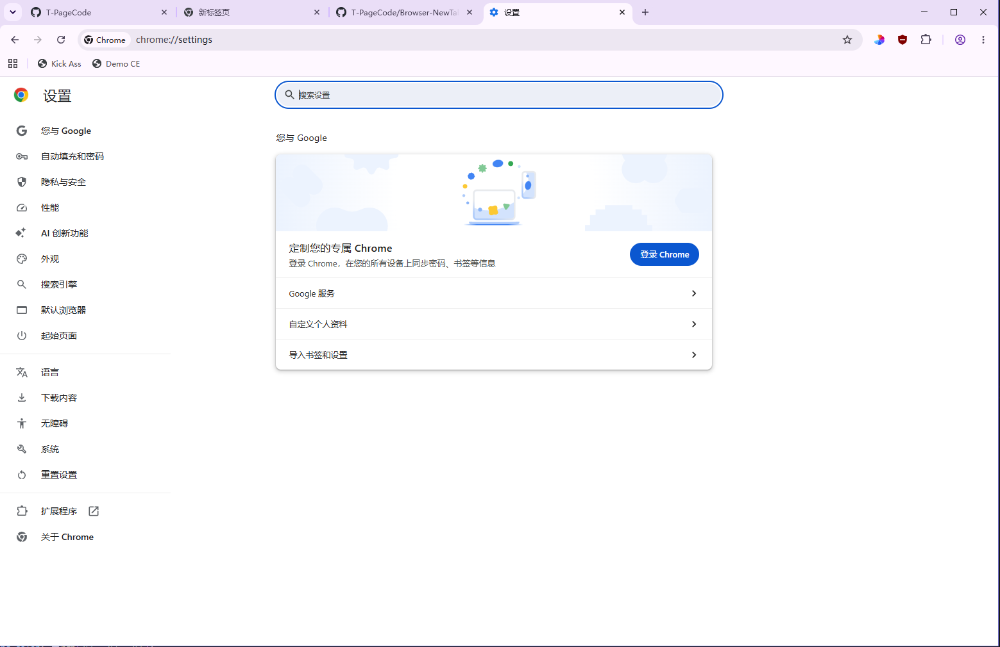
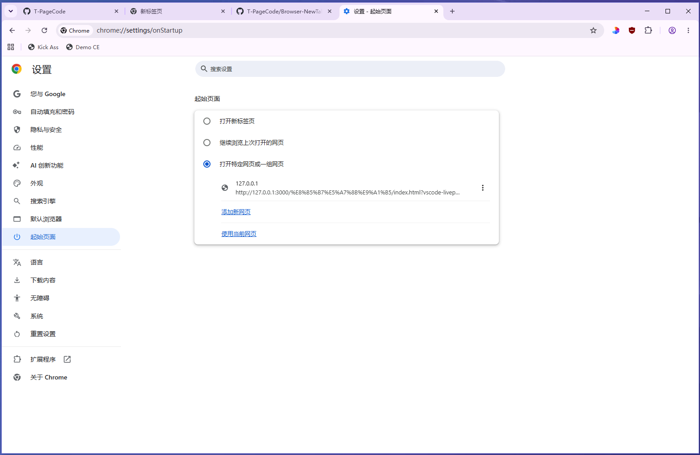
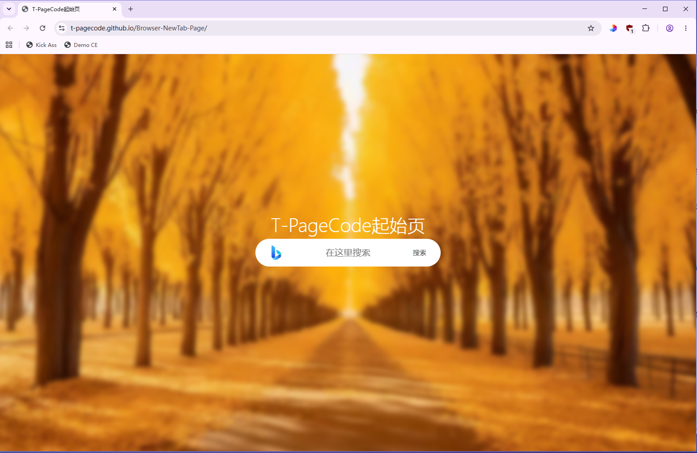
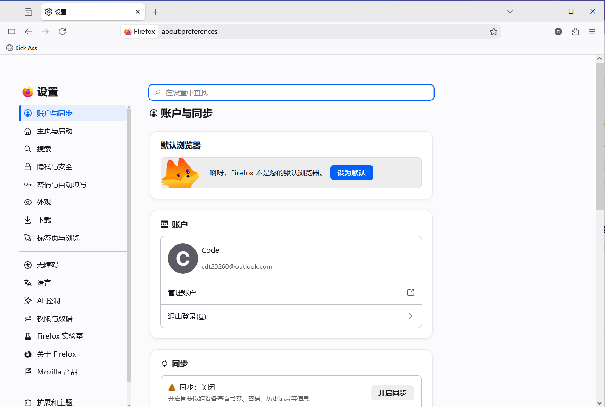
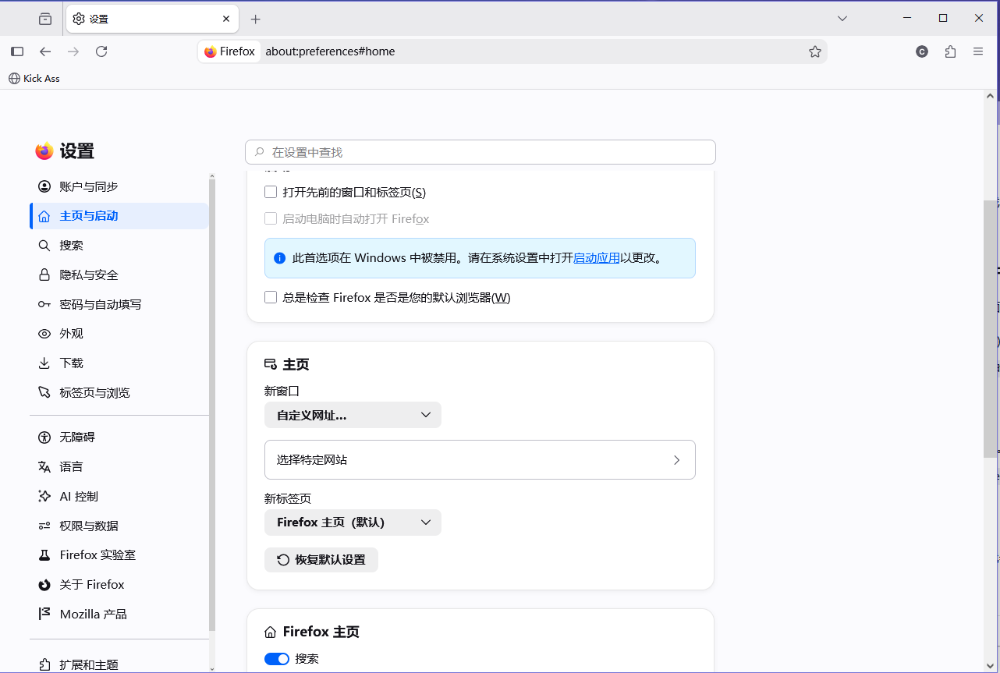
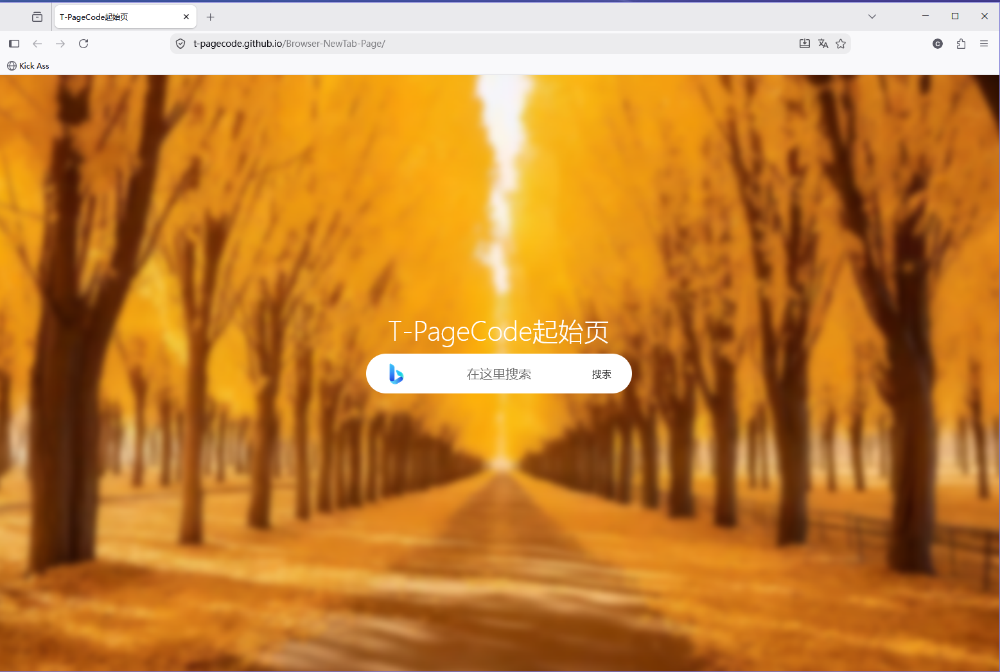

# Browser-NewTab-Page
T-PageCode起始页
# 设为默认起始页教程
## Chrome
#### 首先在地址栏输入`chrome://settings`进入设置界面或点击右上角三点菜单，然后点击`设置`

#### 然后点击`起始页面`

#### 如果列表有一些网页（比如图里的127.0.0.1）就点击三点菜单，选择`移除`
#### 点击`添加新网页`，然后在输入框里输入`https://t-pagecode.github.io/Browser-NewTab-Page`，点击`添加`
#### 最后关闭所有Chrome窗口与后台程序，或使用Win + R输入cmd后，输入taskkill /f /im chrome.exe，再次启动Chrome就好了

## FireFox
#### 首先在地址栏输入`about:preferences`进入设置界面或点击右上角三杠菜单，点击`设置`

#### 然后点击`主页与启动`

#### 找到`主页`，点击`新窗口`，选择`自定义网址`，点击`选择特定网站`，如果之前有网站了，那就点击对应的“垃圾桶”图标删除。在输入框中填`https://t-pagecode.github.io/Browser-NewTab-Page`，点击`添加网址`
#### 最后关闭所有FireFox窗口与后台程序，或使用Win + R输入cmd后，输入taskkill /f /im firefox.exe，再次启动FireFox就好了

